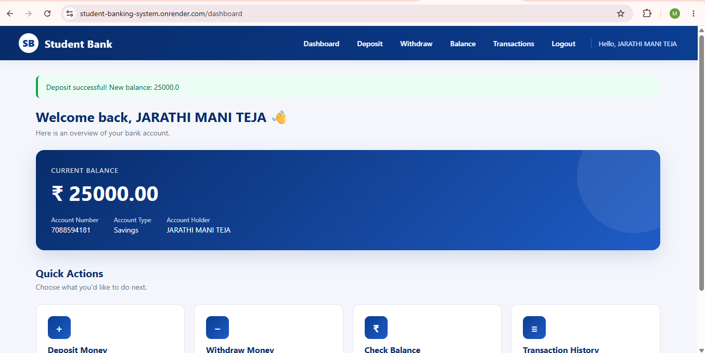
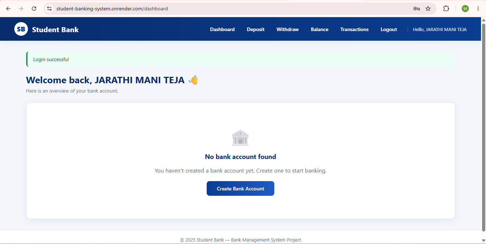
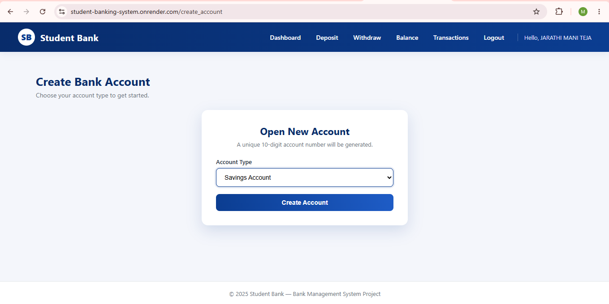
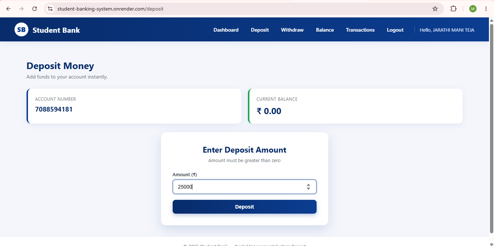
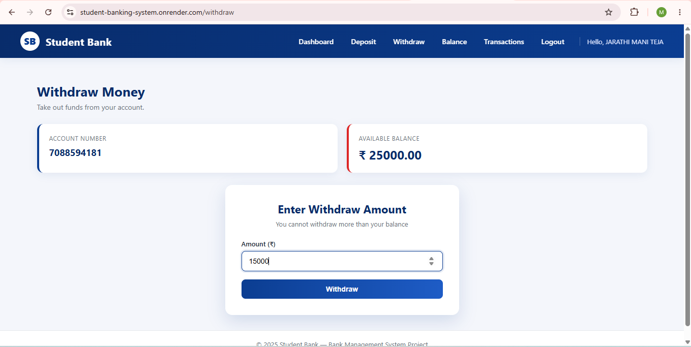
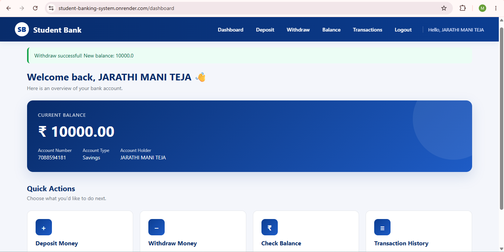
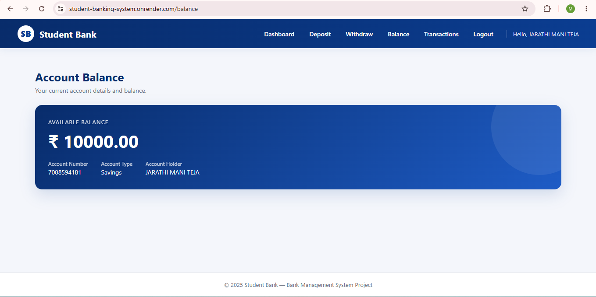

# 🏦 Student Banking System

<p align="center">
  
</p>

<p align="center">
  <b>A Full-Stack Banking Web Application built using Python Flask, MySQL, HTML, CSS and JavaScript.</b>
</p>

<p align="center">
  
  
  
  
  
  
  
</p>

---

# 🌐 Live Demo

🔗 https://student-banking-system.onrender.com

---

# 📖 Project Overview

The **Student Banking System** is a secure and responsive full-stack banking web application developed using **Python Flask** and **MySQL**.

It allows users to register, securely log in, create a bank account, deposit money, withdraw money, check their account balance, and view transaction history through a clean and user-friendly interface.

This project demonstrates backend development, database integration, authentication, CRUD operations, session management, and deployment using Render.

---

# ✨ Features

- 👤 User Registration
- 🔐 Secure Login & Logout
- 🏦 Create Savings Account
- 🏦 Create Current Account
- 💰 Deposit Funds
- 💸 Withdraw Funds
- 💳 Check Account Balance
- 📜 View Transaction History
- 🔒 Session-Based Authentication
- ✅ Input Validation
- 📱 Responsive User Interface

---

# 🛠️ Tech Stack

| Technology | Purpose |
|------------|----------|
| Python | Backend |
| Flask | Web Framework |
| MySQL | Database |
| HTML5 | Frontend |
| CSS3 | Styling |
| JavaScript | Client-side Functionality |
| Render | Deployment |

---

# 📂 Project Structure

```text
student-banking-system/
│
├── app.py
├── schema.sql
├── requirements.txt
├── Procfile
├── README.md
├── LICENSE
├── .gitignore
│
├── static/
│   └── style.css
│
├── templates/
│   ├── base.html
│   ├── login.html
│   ├── register.html
│   ├── dashboard.html
│   ├── create_account.html
│   ├── deposit.html
│   ├── withdraw.html
│   ├── balance.html
│   ├── transactions.html
│   └── admin.html
│
└── screenshots/
```

---

# 🖼️ Application Screenshots

## 📝 Registration Page


---

## 🔑 Login Page


---

## 🏦 Dashboard (No Account)



---

## 🏦 Create Bank Account



---

## 📊 Dashboard


---

## 💰 Deposit Money



---

## 📈 Dashboard After Deposit


---

## 💸 Withdraw Money



---

## 📉 Dashboard After Withdrawal



---

## 💳 Account Balance



---

## 📜 Transaction History


---

# ⚙️ Installation

## Clone the Repository

```bash
git clone https://github.com/2303a51141/Student_Banking_System.git
```

## Navigate to the Project

```bash
cd Student_Banking_System
```

## Install Dependencies

```bash
pip install -r requirements.txt
```

## Configure the Database

1. Install MySQL.
2. Create a database.
3. Import `schema.sql`.
4. Update the MySQL credentials in `app.py`.

## Run the Application

```bash
python app.py
```

Open:

```
http://127.0.0.1:5000
```

---

# 🗄️ Database Design

```text
Users
 │
 ├── Accounts
 │
 └── Transactions
```

---

# 🔄 Application Workflow

```text
Register
      │
      ▼
Login
      │
      ▼
Dashboard
      │
      ▼
Create Bank Account
      │
      ▼
Deposit / Withdraw
      │
      ▼
Check Balance
      │
      ▼
View Transaction History
```

---

# 🎯 Learning Outcomes

- Full-Stack Web Development
- Flask Framework
- MySQL Database Integration
- CRUD Operations
- Authentication
- Session Management
- Responsive UI Design
- Database Design
- Deployment using Render

---

# 🚀 Future Enhancements

- Money Transfer Between Users
- Email Notifications
- Password Reset
- OTP Verification
- PDF Bank Statements
- REST API Development
- JWT Authentication
- Two-Factor Authentication

---

# 👨‍💻 Author

**Mani Teja Patel Jarathi**

🎓 B.Tech – Computer Science & Engineering  
🏫 SR University

### 📬 Connect with Me

- **GitHub:** https://github.com/2303a51141
- **LinkedIn:** https://www.linkedin.com/in/mani-teja-patel-jarathi
- **Portfolio:** https://portfolio-mani00.vercel.app

---

# ⭐ Support

If you found this project useful, please consider giving it a ⭐ on GitHub.

---

# 📜 License

This project is licensed under the **MIT License**.

---

<p align="center">
Made with ❤️ using Python, Flask, MySQL, HTML, CSS and JavaScript.
</p>
